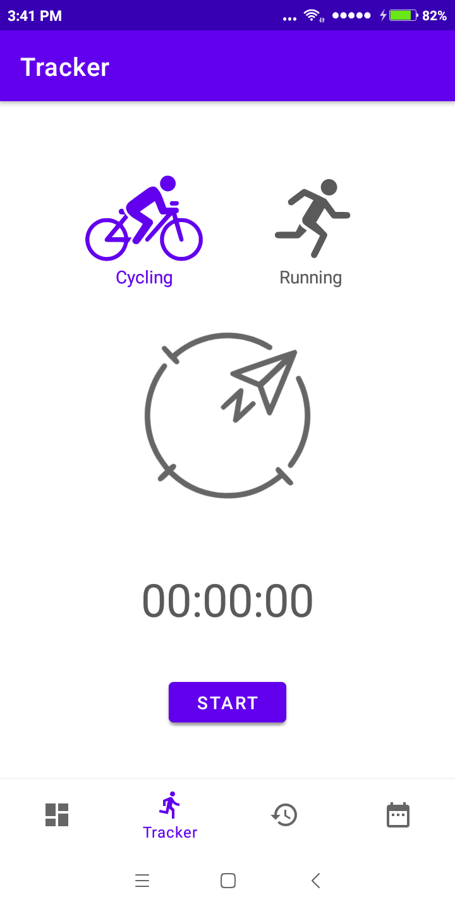
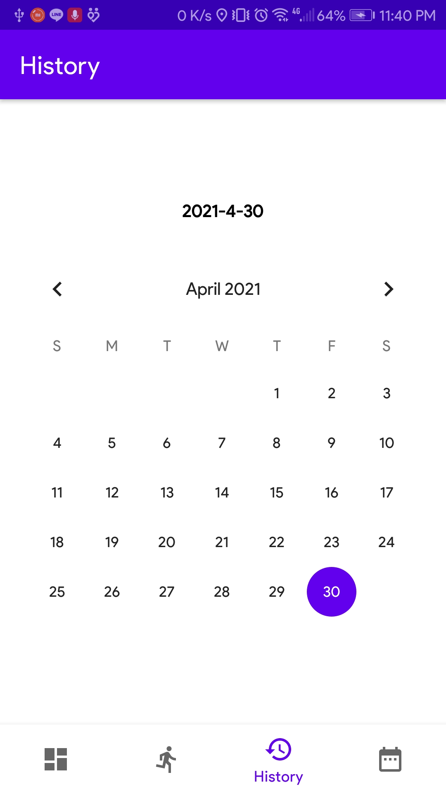
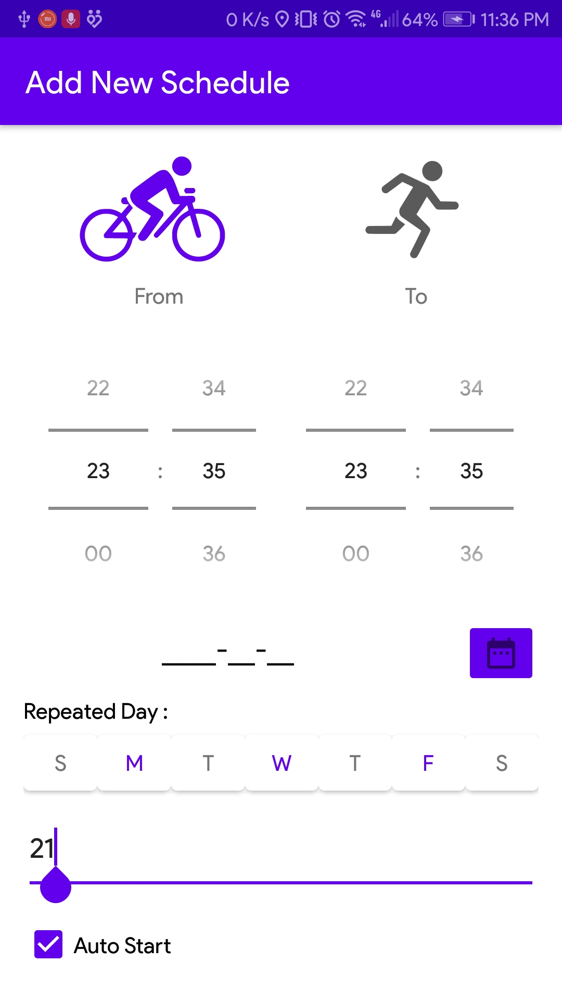

# IF3210-2021-Android-K3-07
Tugas Besar 3 IF3210 - Android Workout

## Deskripsi Aplikasi
Aplikasi workout merupakan aplikasi pada platform Android yang menunjanng kegiatan workout. Fitur-fitur yang disediakan adalah berita olahraga, pelacakan latihan untuk jenis latihan walking (berjalan) dan cycling (bersepeda), pencatatan history latihan, dan penjadwalan latihan. 

## Cara Kerja
### Sport News  
Ketika fragment untuk sport news aktif, aplikasi akan <b>mengambil data dari API</b> sport news menggunakan retrofit dan mengubahnya ke dalam bentuk list class News yang terdiri dari atribut judul berita, deskripsi berita, url gambar, dan url berita. Lalu dengan menggunakan <b>recycler view</b> dan mengattach adaptor untuk list berita sehingga setiap item class pada list akan ditampilkan dalam satu card yang terdiri dari gambar, judul, dan deskripsi berita. 

Design halaman juga <b>responsive</b>. Jika orientasi device potrait, card akan ditampilkan dalam satu kolom, sedangkan jika orientasinya landscape card ditampilkan dalam dua kolom. Ketika salah satu card diklik, maka akan dibuat intent baru yang memuat <b>webview</b> untuk menampilakn berita sesuai url item tersebut.

### Training Tracker
Training tracker merupakan halaman yang digunakan untuk melakukan pelacakan latihan yang terdiri dari dua jenis, yaitu <b>Cycling</b> yang melacak jarak tempuh dan rute yang dilalui berupa angka dan peta serta <b>Walking/Running</b> yang melacak jumlah step yang dilakukan. Sistem pelacakan ini berjalan pada <b>background</b> memanfaatkan services dan memiliki <b>kompas</b> yang diimplementasikan dengan memanfaatkan sensor. Ketika button start ditekan, timer dan sistem pelacakan akan mulai berjalan pada background dan mencatat jumlah langkah atau kilometer dan lokasi pengguna. Setelah button stop ditekan, history tersebut akan disimpan ke database dan akan dibuat intent baru yang menampilkan history exercise yang baru dilakukan.

### Training History
Training history ditampilkan dengan memanfaatkan recycler view dan card untuk setiap item pada database history yang disimpan menggunakan SQLite. Pengambilan data (query) dilakukan menggunakan DAO sesuai tanggal yang dipilih pada kalender. Log history dan detail log history ini diimplementasikan menggukanan <b>fragment</b> yang mendukung <b>responsive</b>. 

Ketika layar dalam keadaan potrait, framelayout yang digunakan hanya satu untuk history log saja dan ketika item diklik akan dilakukan replace fragment history log menjadi history log details. Ketika device dalam keadaan landscape, digunakan dua framelayout masing-masing satu untuk history log dan satu untuk history log details bersebelahan. 

Untuk history cycling, terdapat button untuk melihat maps rute pelacakan lokasi selama pengguna bersepeda. Maps dimuat dalam sebuah intent dan garis rute digambarkan dengan <b>polylines</b> di atas google maps dari pemanggilan menggunakan google maps API.

### Training Scheduler

## Library yang Digunakan
* Retrofit : digunakan untuk mengambil data berita olahraga dari API. Justifikasi penggunaannya adalah karena library ini dapat mengubah antarmuka API menjadi callable object sesuai dengan class yang kita buat, sehingga untuk menampilkan hasil API call tersebut dapat mengakses atribut kelas dari objek tersebut.

* EasyPermissions : digunakan untuk meminta izin akses terhadap perangkat. Justifikasi penggunaannya adalah karena library ini dapat menyederhanakan sistem logika perihal permintaan izin akses ketika menghadapi sistem operasi Android M ke atas sehingga mengurus izin akses menjadi lebih mudah.

* Timber : digunakan untuk mencetak data dari kode ke terminal. Justifikasi penggunaannya adalah karena library ini dapat mempermudah dalam debugging kode untuk memeriksa apakah aplikasi yang dibuat sudah sesuai atau belum langsung pada Build, tidak pada Debug sehingga proses pemeriksaan hasil kode lebih mudah dan cepat.

* Google Play Service Maps dan Location : digunakan untuk menggunakan google maps pada aplikasi. Justifikasi penggunaannya adalah karena dengan library ini kita dapat memanfaatkan dan memanggil API google maps sehingga bisa digunakan dalam aplikasi.

* Glide : digunakan untuk menampilkan gambar pada card dari sumber url. Justifikasi penggunannya karena penggunaaanya sederhana dan dapat menampilkan gambar yang bersumber dari url

## Screenshot Aplikasi
### Tampilan potrait Sport News 
 
### Tampilan landscape Sport News 
 
### Tampilan Webview Sport News 
 
### Tracker 
 
### Tracker start 
 
### Training History 
 
### Log History potrait 
 
### Detail log History potrait Walking 
 
### Log dan detail History landscape 
 
### Detail log History potrait Cycling 
 
### Map rute Cycling 
 
### Scheduler 
 
### Add new Schedule
 
### Notification
 

## Pembagian Kerja Anggota Kelompok
| NIM | Nama | Pembagian Kerja |
|-----|------|-----------------|
| 13518045 | Anna Elvira Hartoyo | Fitur Sport News Fitur Training History |
| 13518096 | Naufal Arfananda Ghifari | Fitur Training Scheduler|
| 13518126 | Evan Pradanika | Fitur Training Tracker|
